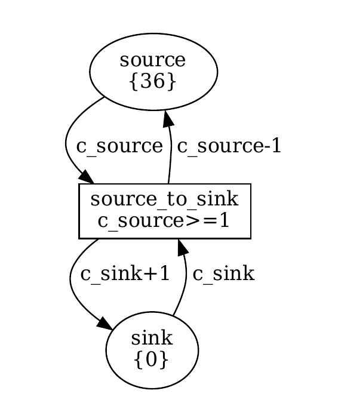
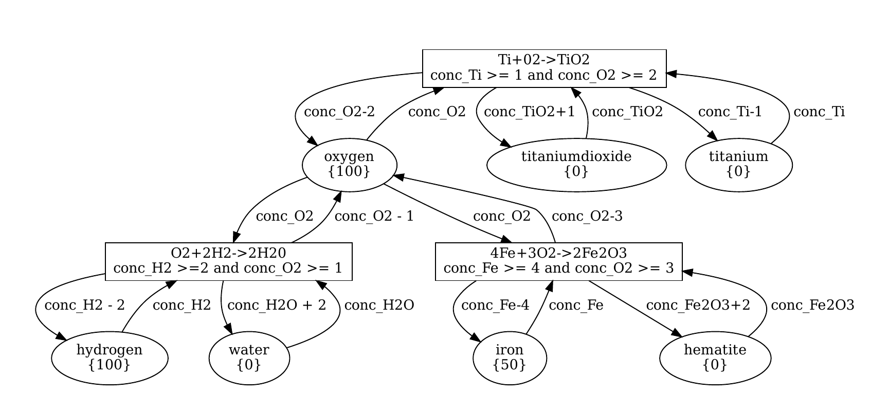
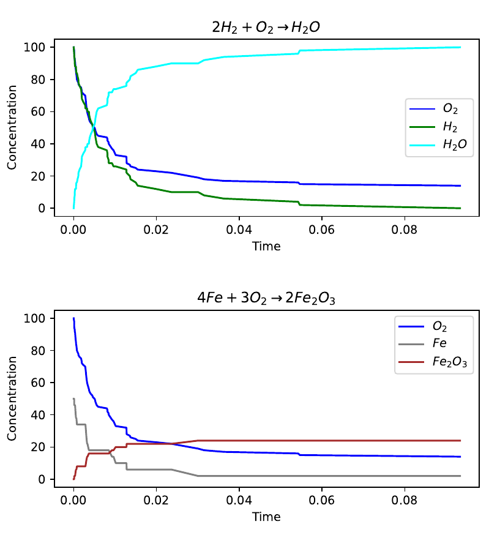

Stochastic Petri-Net (SPN) plugin for SNAKES
============================================

This repository hosts a plug-in for the Python library [SNAKES]
that provides simple quantitative stochastic simulation features
to Petri-Nets created in SNAKES.
Each place is assigned an integral number of tokes,
and when the conditions of a transition are met
it fires after a randomly distributed delay
(sampled from an exponential distribution).
This simulation is an implementation of the Gillespie algorithm 
as described in the book
[Modeling in Systems Biology - The Petri Net Approach][book] (see page 141).

### Case study
This plugin was originally created for a case study
*Stochastic Simulation of Competition for Hormone Receptor*.
All code of the [case study] is included for scientific reproducibility.
It may also serve as a more extended example how the plugin can be used.

### Why Python for SPN simulation?
The main advantage of using Python over GUI Petri-Net applications
is that it provides much more flexibility in running automated
experiments and/or in processing data.
For example, in most GUI applications it is not possible
to programmatically run a Petri-Net for many different
parameter-configurations, and to collect and aggregate the results
automatically. Using Python also gives the freedom in choosing
what and how to measure the dynamics of a Petri-Net,
and this data can readily be processed with the many data-science
libraries available for Python (e.g. numpy, matplotlib, pandas, etc.).

The disadvantages of using Python is that (1) it is very slow
(SNAKES is written in pure Python, which is an interpreted programming
language), and (2) GUI applications provide more features
and may be more appealing to non-programmers.

### Stochastic Petri-Nets?
Stochastic Petri-Nets (SPNs) are similar to normal Petri-Nets,
except that there is a continuous time variable and
enabled transitions do not fire immediately.
Instead, once a transition becomes enabled, it samples
a random delay, which is used to determine the firing time,
and the firing event is added to a timeline (a chronologically
ordered queue) of transition firings.
The simulated time variable jumps from the timestamp of one firing to that
of the next enqueued firing. 

The delays are randomly distributed according to an exponential
distribution with a rate parameter (often denoted as λ).
This λ can be a constant, but can (for example) also depend
on the number of tokens of one or more of the incoming
places of a transition. This `snakes_spn` plugin allows λ
to be any used-defined function.

Informally, the rate models how quickly a transition occurs.
For example, one may want to model a chemical reaction
whose rate depends on the concentration of the reactants
(the Gillespie algorithm was invented for this purpose).
Note that different transitions may work on very different rate,
e.g. to model a fast and a slow chemical reaction that run in parallel.
A higher λ models a faster reaction/transition.
Note that SPNs, despite using integral token counts,
can be used to approximate continuous processes
by averaging out over multiple simulation runs.


Example
-------
(If not familiar with the SNAKES library,
it may be interesting to follow a tutorial on the [SNAKES-website][SNAKES]
first).

The following toy-example demonstrates the usage
of the SPN plugin. It creates a simple Petri-Net
consisting of two places (a 'source' and a 'sink')
and a single transition from the source to the sink.
The rate of the random delay is proportional to the
number of tokens in the source
(see the line `rate_function=Expression("c_source"))`).
The function `run_simulation(spn)` runs the Gillespie simulation
until no more transitions are possible (also a maximum number of
transitions and/or a maximum amount of simulated time can be specified).
The `output` is a dictionary mapping
the names of the places in the SPN to the number
of tokens at every step. It also includes a `"time"` key
that maps to the timestamp of the simulated time
(i.e., cumulative delays) per time step.

<picture>
  
</picture>

```python
from spn_tools.run_simulation import run_simulation
import snakes_spn.plugin as spn_plugin
import snakes.plugins
snakes.plugins.load([spn_plugin], "snakes.nets", "snk")
from snk import PetriNet, Place, Expression, Transition, Variable, tInteger

def make_simple_spn(num_input_tokens: int = 36) -> PetriNet:
    """
    Construct a simple network with one transition.
    """
    spn = PetriNet("TestRunSimulationNet")
    spn.add_place(Place("source", num_input_tokens, tInteger))
    spn.add_place(Place("sink", 0, tInteger))
    spn.add_transition(Transition("source_to_sink",
                                  guard=Expression("c_source>=1"),
                                  rate_function=Expression("c_source")))

    spn.add_input("source", "source_to_sink", Variable("c_source"))
    spn.add_input("sink", "source_to_sink", Variable("c_sink"))

    spn.add_output("source", "source_to_sink", Expression("c_source-1"))
    spn.add_output("sink", "source_to_sink", Expression("c_sink+1"))
??? from here until ???END lines may have been inserted/deleted
    return spn

num_input_tokens = 36
spn = make_simple_spn(num_input_tokens)
output = run_simulation(spn)
```

Two more advanced examples can be found 
in the file [snakes_spn/test/testing_tools.py][titanium],
being (scientifically probably inaccurate) simulations
of chemical reactions.
The most advanced corresponds to the following network
with three transitions:
<picture>
  
</picture>

The plugin comes with tools to draw graphs of concentrations (number of
tokens on places) over time, such as the following:
<picture>
  
</picture>

Installation
------------
(If you are using a virtual environment for Python,
activate it first).
In a terminal:
1. Make sure that SNAKES, numpy, scipy and matplotlib are installed.
    Install them via `pip install snakes numpy scipy matplotlib` if necessary.
2. Clone this repository to any directory of choice on your computer.
3. `cd` to the top-level directory of this plugin (the directory
    containing `setup.py`) and run:
    ```
    pip install .
    ```

### Dependencies
The `snakes_spn` plugin uses the following Python libraries:
* `snakes`
* `numpy`
* `matplotlib`
* `scipy`

It is expected that at least all versions released 
between 2022-2023 are compatible.

Usage
-----
Most documentation can be found in the source code in the form
of doc-strings.

Make sure to import the libraries in the correct order:
```python
from spn_tools.run_simulation import run_simulation
import snakes_spn.plugin as spn_plugin
import snakes.plugins
snakes.plugins.load([spn_plugin], "snakes.nets", "snk")
from snk import PetriNet, Place, Expression, Transition, Variable, tInteger
```
This plugin is compatible with the `"gv"` plugin,
so one can optionally replace the corresponding line in the above with:
```python
snakes.plugins.load([spn_plugin, "gv"], "snakes.nets", "snk")
```
???END

In a Stochastic Petri-Net, each place has an integral number of tokens.
In SNAKES, each place has a list of Python objects as tokens.
**The `snakes_spn` plugin requires that *all* places in an SPN
are initialised with a singleton list containing a single
`int` as token (in the SNAKES-sense).**
The value of this `int` represents the number of tokens
in the SPN sense. Transitions typically depend on the number of
SPN-tokens in connected places, so it may often be necessary
to send this token to the transition and back after firing,
even if the value is unchanged.

SPNs work mostly identical to standard SNAKES Petri-Nets.
The biggest difference is that a `Transition` now
also takes a `rate_function` argument, which is
(just like the `guard` argument) a SNAKES `Expression`.
It should evaluate to a number, representing the rate
of the delay distribution of the transition.
When the transition becomes enabled, it samples
an exponentially distributed delay whose rate
is given by the `rate_function` (in statistics it is often
denoted by λ). It can be a constant, but also depend on the
number of tokens on incoming places.

See the source file [/snakes_spn/plugin.py] for more documentation.

## Library functions
The files [/spn_tools/build_spn.py] and [/spn_tools/run_simulation]
provide tools for building, simulating (including
multiple runs)and plotting SPNs.
The source-code is documented and should be self-explanatory.

Meta
----
The plugin was written by Lulof Pirée in 2022
for a master course in bio-modelling at Leiden University.
It has been developed completely independent of SNAKES itself
(i.e., by a different author).

The plugin is open-source under the [GNU Public License v3][license].

There is only a single stable release of the plugin,
and it is not in further development.


[SNAKES]: https://snakes.ibisc.univ-evry.fr/
[book]: https://link.springer.com/book/10.1007/978-1-84996-474-6
[case study]: /spn_case_study
[license]: /LICENSE
[titanium]: /snakes_spn/test/testing_tools.py
